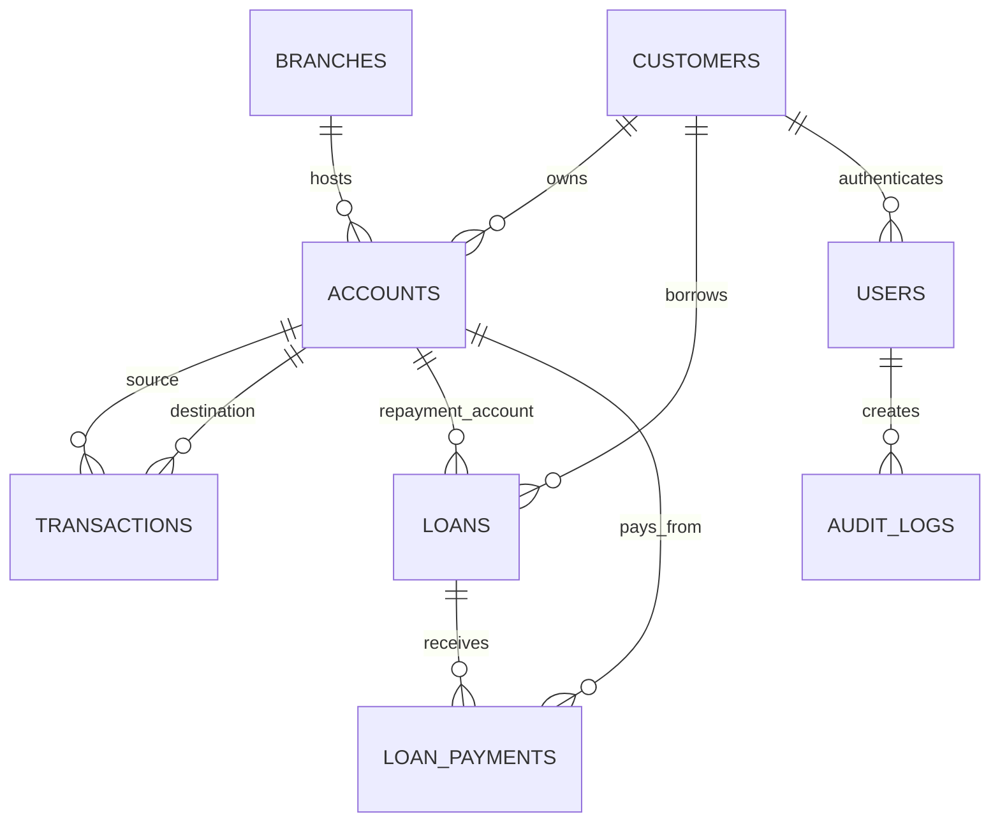

# VBS Database Design

## Conceptual Design

The Virtual Banking System manages customers, bank branches, accounts, transactions, loans, authentication users, loan payments, and audit logs.

Main relationships:

- One branch has many accounts.
- One customer has many accounts.
- One customer can have many loans.
- One account belongs to one customer and one branch.
- One transaction can affect one account or two accounts.
- One loan can have many loan payments.
- One user authenticates either a customer or an administrator.

## ERD

## Logical Schema

- `branches`: branch identity, city, address, phone, and status.
- `customers`: fake national code, name, birth date, mobile, email, address, and status.
- `users`: login username, password hash placeholder, role, status, failed logins, and optional customer link.
- `accounts`: customer, branch, account number, account type, balance, status, and opened date.
- `transactions`: source account, destination account, amount, type, status, description, and date.
- `loans`: customer, repayment account, principal, interest rate, term, remaining balance, status, and dates.
- `loan_payments`: loan repayment history.
- `audit_logs`: security and banking audit events.

## 3NF Explanation

The schema is in Third Normal Form:

- Every table has a primary key.
- Non-key attributes depend on the key of their own table.
- Branch details are not repeated in accounts.
- Customer identity data is separated from authentication data.
- Transactions are separated from accounts so account balance and transaction history are not mixed.
- Loan payments are separated from loans because one loan can have many payments.
- Audit events are separated from operational tables.

## Constraints And Business Rules

The schema uses primary keys, foreign keys, unique constraints, `ENUM` statuses, and `CHECK` constraints.

Important examples:

- Account balance cannot be negative.
- Loan remaining balance cannot be negative.
- Transaction, loan, and payment amounts must be positive.
- National code, mobile, email, username, and account number are unique.
- Foreign keys connect customers, accounts, branches, users, loans, payments, transactions, and audit logs.

MySQL 9.6 does not allow `CHECK` constraints on columns that are also used in foreign key referential actions. Because of that, these rules are enforced by triggers:

- Customer users must reference a customer, while admin users must not.
- Transaction account direction must match the transaction type.

## Stored Procedures And Transactions

Financial operations are implemented through stored procedures:

- `sp_deposit`
- `sp_withdraw`
- `sp_transfer`
- `sp_pay_loan`
- `sp_record_login_attempt`
- `sp_check_account_status`

Money-moving procedures use `START TRANSACTION`, `SELECT ... FOR UPDATE`, `COMMIT`, `ROLLBACK`, and exception handlers. This ensures operations either fully succeed or fully fail.

## Indexing

In MySQL InnoDB, primary keys are clustered indexes. Extra indexes in `sql/02_indexes.sql` are secondary indexes, equivalent to non-clustered indexes in many database courses.

Indexes support searches by customer identity, account number, account/customer, transaction date, loan status, branch city, and audit event.

